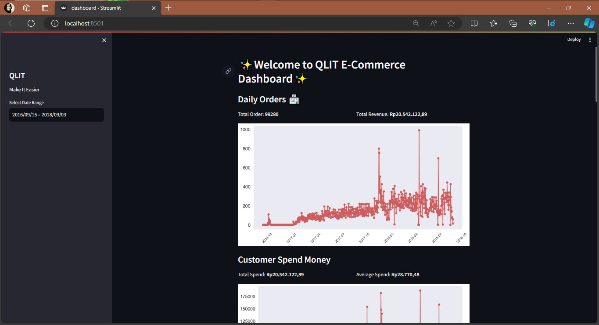

# QLIT E-Commerce Project Akhir Analisis Data - Dicoding

This repository contains the final project for the Data Analytics course on Dicoding. The project aims to analyze e-commerce data and extract valuable insights.

## Setup Environment
conda activate --name main-ds python=3.12.0
conda activate main-ds
pip install pandas matplotlib seaborn jupyter streamlit

## Run Streamlit App
streamlit run dashboard.py
or you can also use
py -m streamlit run dashboard.py

## Screenshoot

