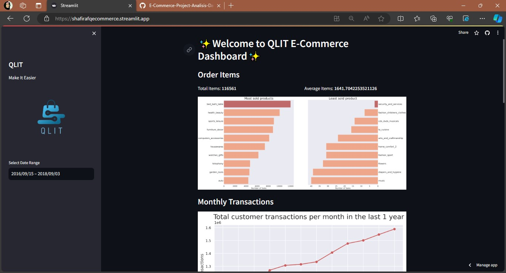

# QLIT E-Commerce Project Akhir Analisis Data - Dicoding

This repository contains the final project for the Data Analytics course on Dicoding. The project aims to analyze e-commerce data and extract valuable insights.

# File Structure
.
├── dashboard

├── __pychache__

│   ├── all_data.csv

│   ├── dashboard.py

│   ├── func.py

│   └── qlit.png

├── dataset_e-commerce

│   ├── New Text Document.txt

│   ├── customers_dataset.csv

│   ├── geolocation_dataset.csv

│   ├── order_items_dataset.csv

│   ├── order_payments_dataset.csv

│   ├── order_reviews_dataset.csv
│   ├── orders_dataset.csv
│   ├── product_category_name_translation.csv
│   ├── products_dataset.csv
│   ├── products_dataset.csv
|   └── sellers_dataset.csv
├── README.md
├── Projek_Analisis_Data_E_Commerce.ipynb
├── requirements.txt
├── screenshoot.jpg
└── launching.jpg

## Setup Environment
conda activate --name main-ds python=3.12.0
conda activate main-ds
pip install pandas matplotlib seaborn jupyter streamlit

## Run Streamlit App
streamlit run dashboard.py
or you can also use
py -m streamlit run dashboard.py

## Screenshoot
atau bisa kunjungi link berikut : https://shafirafqecommerce.streamlit.app/

